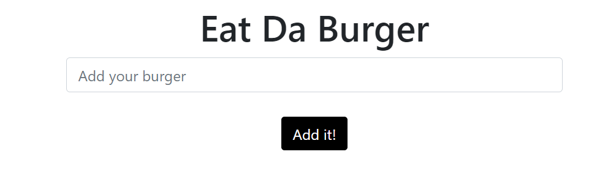
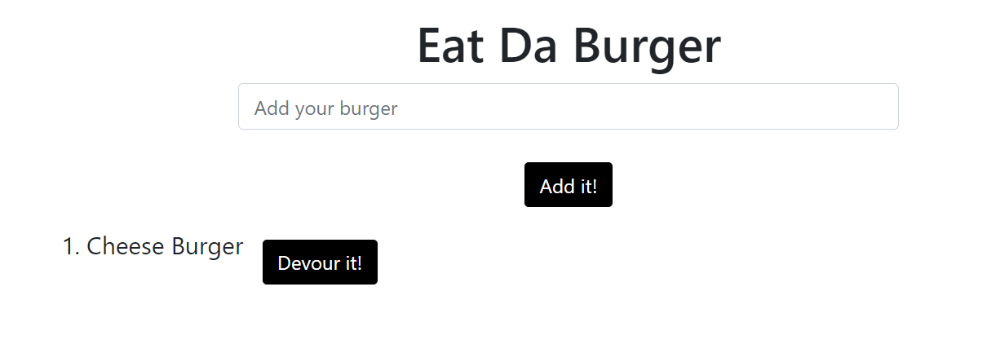

# Eat Da Burger

## Table of Contents

* [General Info](#general-info)
* [Technologies](#technologies)
* [Features](#features)
* [How to Use](#how-to-use)
* [Application Demo](#application-demo)
* [Application Link](#application-link)
* [License](#license)
* [Contact](#contact)

## General Info

A logger that allows users to add a burger, then "devour" it.

## Technologies

* HTML
* CSS
* JavaScript
* Express
* Handlebars
* ORM
* MySQL

## Features

* After connecting to local host 8080, the user is able to input the name of a burger, then "devour" it using the "Devour it!" button.

## How to Use

After downloading the code, connect to local host 8080 using nodemon. Enter the name of a burger in the "Add your burger" field, then click on the "Add it!" button. To remove a burger, select the "Devour it!" button.

## Application Demo

[Deployed Code](https://eat-da-burger-hw-13.herokuapp.com/)

## Application Link

https://eat-da-burger-hw-13.herokuapp.com/

## License

ISC

## Contact

* Email: jones.m.kasey@gmail.com

* GitHub: https://github.com/joneskm72